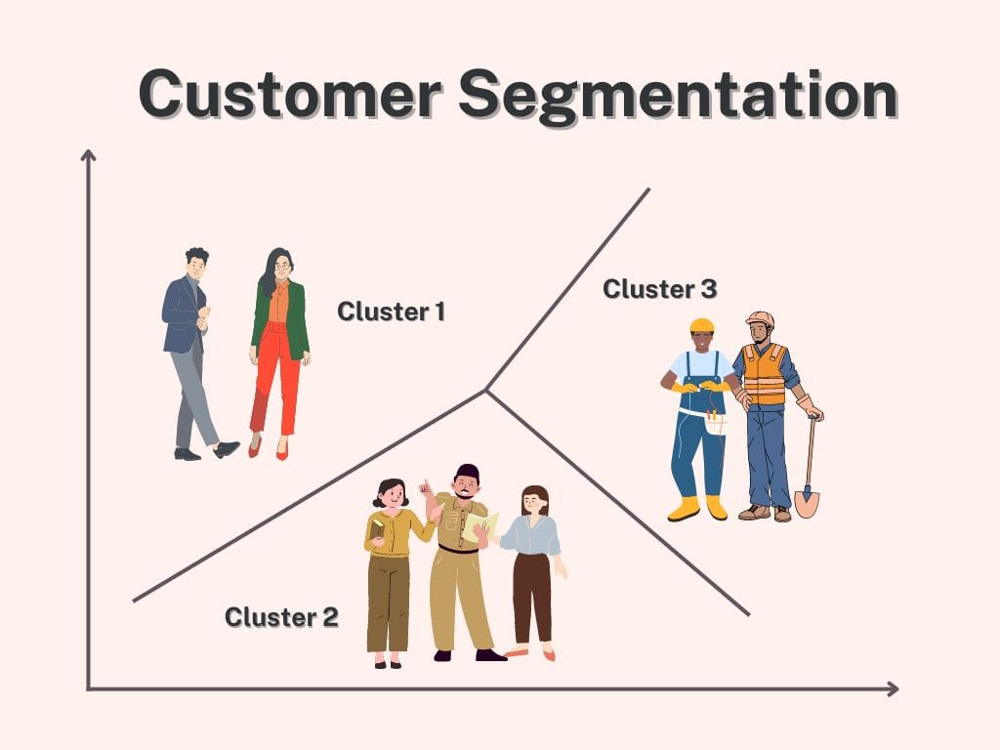

# Customer Segmentation using K-Means Clustering

  

This project applies unsupervised machine learning techniques to perform customer segmentation using the Mall Customers dataset. The objective of the project is to identify distinct groups of customers based on their annual income and spending behavior.

K-Means clustering was used to partition customers into meaningful segments. The optimal number of clusters was determined using the Elbow Method, and clustering performance was evaluated using the Silhouette Score to ensure clear separation between customer groups.

This project demonstrates how clustering algorithms can be applied to real-world business problems such as customer behavior analysis, targeted marketing, and data-driven decision making.

## Techniques Used
- K-Means Clustering
- Elbow Method
- Silhouette Score
- Data Visualization
- Python (Pandas, Scikit-learn, Matplotlib)
